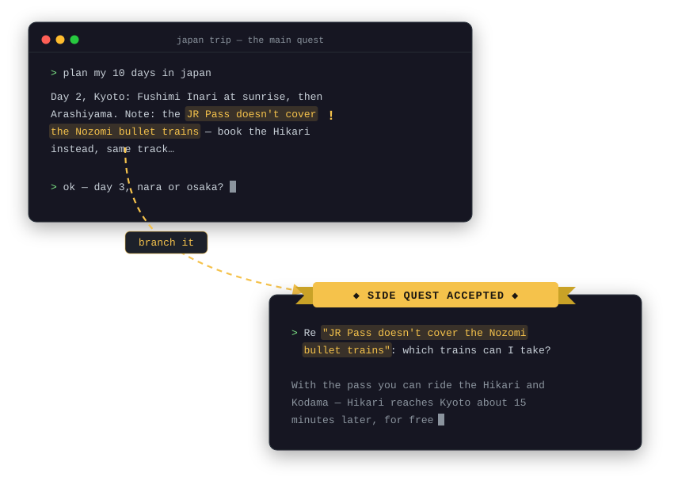

# lemux

A tmux-native, node-based navigator for **branched Claude Code sessions**.

<p align="center">
  
</p>

A single Claude Code conversation is linear. When you're learning or digging
into a topic, an assistant message often contains three things you want to
chase — but chasing them inline bloats your context and derails the main plot.

lemux lets you **highlight any part of an assistant response and fork it into
a side quest**: a real, fully queryable Claude Code session that inherits the
*entire* parent conversation, opens in its own tmux window, and can itself be
branched further. When a side quest is done, delete it — nothing flows back
upstream, your main session never knew it existed.

There is no merge. Just diverge, explore, delete.

## How it works

lemux is ~300 lines of bash on top of things that already exist:

- Claude Code stores every session as a JSONL transcript and natively supports
  `--resume <id> --fork-session` — a fork is a full snapshot copy of the
  parent transcript under a new session ID. The parent is never touched.
- tmux provides the windows, the text selection (copy-mode), and the popup.
- fzf renders the branch tree and jumps between windows.

The only state lemux keeps is `~/.lemux/tree.json`: one entry per session with
its parent, the excerpt it branched on, and which tmux window it lives in.
A `SessionStart` hook (installed once by `lemux enable`) makes every claude
session tag its tmux pane with its session ID as it starts — that is how any
session, however launched, is branchable with zero ceremony.

## Install

Requires: `tmux` ≥ 3.2, `fzf`, `jq`, `claude`.

```sh
curl -fsSL https://raw.githubusercontent.com/Photon48/lemux/main/install.sh | bash
```

Or from a checkout: `./install.sh`. Either way it copies `lemux` to
`~/.local/bin`, writes the keybindings into `~/.tmux.conf`, merges lemux's
lifecycle hooks into `~/.claude/settings.json` (`lemux enable` — your own
hooks and settings are untouched), and reloads tmux. Everything is idempotent —
re-running replaces lemux's own entries and nothing else. Uninstall by deleting
`~/.local/bin/lemux`, the `>>> lemux >>>` block in `~/.tmux.conf`, the hook
entries mentioning `lemux` in `~/.claude/settings.json`, and `~/.lemux`.

## Use

Run claude inside tmux — any way you like: plain `claude`, `--continue`,
`--resume`, whatever. There is nothing to start and nothing to declare: every
session announces itself to lemux as it starts, and the first time you branch
from it (`prefix + B`) it is enrolled in `~/.lemux` as a topic root, named
after its folder. From then on it's a normal lemux topic — tree, jumping,
pruning, all of it. Topics are scoped to the folder they run in, exactly like
`claude --resume`.

To stop tracking a topic entirely, `lemux rm <name>`: its windows close, its
side-quest transcripts are deleted, and the root conversation is kept on disk
(it's yours — visible in `claude --resume`), just no longer lemux's business.
`lemux rm` on a branch id (or `prefix + X` inside one) deletes that side
quest and its subtree, transcripts included.

Open windows follow a path discipline: they are only ever the chain you're
inside (root → side quest → deeper side quest). Wherever you land through
lemux — exiting a session's claude walks you up to its parent, jumping in
the tree drops you anywhere — every window in the topic outside the new
path closes, sibling side quests included. The tree and every transcript
survive pruning, so anything closed is one `prefix + T`, enter away;
exiting the root closes the whole topic. (Switching windows with tmux's own
keys is tmux's business — lemux prunes only when it moves you.)

Pruning never kills a session that's working or waiting on you. Every claude
session carries lemux's hooks (merged into `~/.claude/settings.json` by
`lemux enable`; lemux-launched sessions also get them injected via
`--settings`) that report its lifecycle: busy during a turn, waiting at a
permission or input dialog, idle between turns. Only idle windows are pruned.
One known gap: Esc-cancelling a permission dialog emits no event, so that
session stays "waiting" — spared — until you next interact with it.

| Keys | Action |
|------|--------|
| select text, copy it, `prefix + B` | **Branch**: fork this session into a new window, seeded with what you copied |
| `prefix + T` | **Tree**: this session's side quests — type to filter, enter to jump, `ctrl-x` to delete |
| `prefix + X` | **Delete** the current pane's branch and its whole subtree |

The flow: while reading an assistant response, select the sentence you want to
dig into with the mouse and copy it (`cmd-C` on macOS), then hit `prefix + B`.
A popup shows what you're branching on and asks for your question:

```
  branch a side quest  (from litefs)

  on "copy-on-write B-tree so writers never block readers"

  type your question and hit enter · empty enter opens the branch so you
  can type there · ctrl-c cancels

  > why does that avoid write locks_
```

Enter opens a new window running a fork of your session — full parent context
— with the question already sent as:

```
Re "copy-on-write B-tree so writers never block readers": why does that avoid write locks
```

Hit enter on an empty question instead and the branch opens with just the
excerpt waiting in the input box, for you to type there.

Go as deep as you like — branch the branch, branch a different excerpt of the
same message, whatever. `prefix + T` shows where you are. It only ever shows
the tree you're currently in: from any window — the root or a side quest six
levels down — you see that root and its descendants, never another topic's
branches. Navigating is about *this* conversation, not about managing sessions.

```
● litefs
├─ ● copy-on-write B-tree so w…
│  └─ ○ fsync vs fdatasync
└─ ● raft leases
```

`●` = window open, `○` = window closed (enter revives it via `--resume`).

## Notes

- **Deleting**: `rm` on a branch deletes its tmux window, its transcript file,
  and its entire subtree. `rm` on a topic name untracks the topic but always
  keeps the root transcript.
- **Forks are cheap**: a fork shares its full prefix with the parent, so the
  first message usually hits Anthropic's prompt cache.
- **Where the excerpt comes from**: the system clipboard (`pbpaste`), falling
  back to tmux's paste buffer. Because lemux puts each branch in its own
  full-width *window* — never a split — native mouse selection can't pick up
  a neighbouring pane's text.
- Sessions already running when you install (or update) lemux haven't
  announced themselves yet — the SessionStart hook only fires on launch, so
  restart claude in that pane (`claude --continue` picks up right where you
  were) to make it branchable.
- The excerpt pre-fill waits for claude's UI to render (up to ~15 s) before
  typing; it never presses enter, so nothing is ever auto-submitted.
