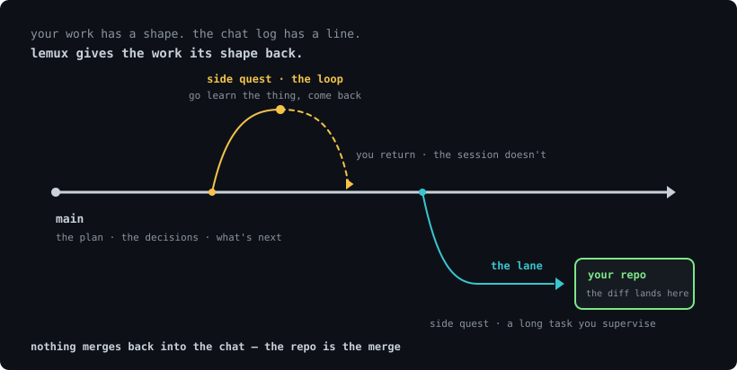
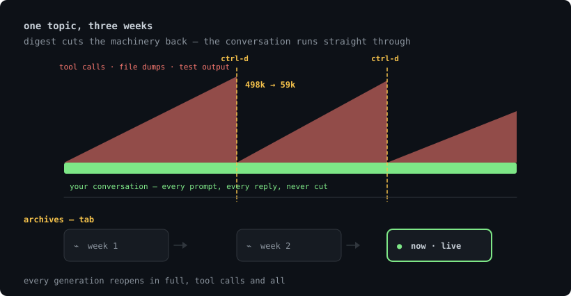

# lemux

**Run coding agents on your workflow — not on their chat log.**

Main holds the plan. Side quests hold everything else. Digest keeps the topic
alive past the context window.



```sh
curl -fsSL https://raw.githubusercontent.com/Photon48/lemux/main/install.sh | bash
```

Needs `tmux` ≥ 3.2, `fzf` ≥ 0.48, `jq`, `claude`. Then run claude in tmux, any
way you already do.

---

## A day in a topic

You're building payments. That's the **topic** — it lives for weeks. The
session you plan in is **main**.

### 09:00 · the loop

The agent mentions idempotency keys. You half-know what it means, and you want
to know properly — but asking here spends the plan's context on a detour.

Highlight the line, `prefix + B`, ask. It opens as a fork that already knows
the whole feature, so there's nothing to re-explain. Ten minutes later you get
it. `prefix + X`.

**Main is byte-for-byte where you left it.** You aren't.

### 11:00 · the lane

Next task: rename `UserAccount` to `Account` across 200 files. Straightforward,
long, and it would bury your plan under tool calls.

So it doesn't go in main. Branch it — it inherits the naming discussion, so no
briefing — set it running, and go back to designing webhooks.


`prefix + T` is the board. Green means done, red means it stopped and needs
you, dim means still going — and the flags survive the window closing, so
something that finished an hour ago is still holding its hand up when you
look. You route your attention; you don't go fishing for it.

The rename finishes. You skim it, tests pass, **and the diff is already in
git** — which is the whole reason a side quest can just be deleted. The repo
is the merge. The session was scaffolding.

### Friday · the ritual

Two weeks in, main is a hundred good decisions buried in 440k tokens of file
dumps and test output. It still resumes, but barely.

`ctrl-d`.



Monday you open the same conversation — every prompt, every reply, every
decision — at 60k instead of 500k. **The topic's memory stops being capped by
the context window.**

### Week 3 · the archive

Someone asks why the migration was safe. That reasoning lives in a session you
digested twice over.

`tab` in the tree, pick the generation, open it. Full tool-call history, exactly
as it ran.

---

| Keys | |
|---|---|
| `prefix + B` | branch a side quest on the text you copied |
| `prefix + T` | the board — `enter` jump · `ctrl-d` digest · `tab` archives · `ctrl-r` rename · `ctrl-x` delete |
| `prefix + X` | delete this side quest + everything under it |

<details>
<summary><b>How it works</b></summary>

One bash script over things that already exist — no daemon, no database, no
wrapper around the agent:

- Claude Code stores every session as a JSONL transcript and supports
  `--resume <id> --fork-session`. A fork is a full snapshot copy under a new
  session ID; the parent is never touched.
- tmux provides the windows, the text selection, and the popups.
- fzf renders the tree.

State is one file, `~/.lemux/tree.json`: per session, its parent, the excerpt
it branched on, and its tmux window. A `SessionStart` hook makes every claude
session tag its pane as it starts — that's why anything running in tmux is
managed with zero ceremony, including sessions you started before installing
lemux (restart them once so the hook fires).

</details>

<details>
<summary><b>Digest — what it keeps, and the numbers</b></summary>

Text is the whole rule: any content block that isn't prose is dropped, images
included. What survives is what you'd get by reading the conversation back.

A transcript is a *tree*, not a list — retries, edited messages and `/clear`
leave abandoned branches in the file. Digest walks `parentUuid` back from the
newest leaf and keeps only that chain. On a real session that dropped 33% of
records as dead ends.

Measured on an 11.2 MB session by resuming each and reading the API's own
token usage:

| | tokens loaded |
|---|---|
| the original | 498,140 |
| its digest | 58,910 |
| empty session, same repo (system prompt, tools, MCP, CLAUDE.md) | 24,003 |

So the entire conversation is ~35k tokens; the other 460k was tool traffic and
screenshots. The popup shows your real numbers before writing anything, and
commits only on `enter`. The whole topic is rewritten at once — main and every
side quest under it.

Digesting archives the old tree rather than deleting it. Archives are detached
from the working tree and stacked on a timeline behind `tab`; `rm` spares
archived transcripts the way it spares roots, and untracking a topic takes its
whole timeline with it.

</details>

<details>
<summary><b>Topics, windows, and pruning</b></summary>

Every session announces itself as it starts; the first branch (`prefix + B`)
enrols it as a topic root named after its folder. Topics are scoped per folder,
like `claude --resume`.

Open windows follow a one-window discipline: a topic only ever has the session
you're inside open. Branching closes the parent behind you; jumping in the tree
closes everything else. The tree and every transcript survive pruning, so
anything closed is one `prefix + T`, enter away. Exiting claude (ctrl-c) leaves
you at a shell in that window — nothing else closes.

Pruning never kills a session that's busy or waiting on you. One known gap:
Esc-cancelling a permission dialog emits no event, so that session stays
"waiting" — spared — until you next interact with it.

`prefix + T` only ever shows the topic you're in: from any window you see that
root and its descendants, never another topic's side quests.

</details>

<details>
<summary><b>Side quests in detail</b></summary>

Each one gets a short name and a one-line brief — where this exploration is
heading — written as it opens, and the briefs chain down the tree so a deep
side quest reads as a story rather than a mystery.

Side quests nest: branch a side quest, branch a different line of the same
answer, go as deep as it takes.

- **Excerpts** come from the system clipboard (`pbpaste`), falling back to
  tmux's paste buffer. Side quests open as full-width windows — never splits —
  so mouse selection can't pick up a neighbouring pane.
- **Big copies** show as first words plus a `⟨N lines copied⟩` badge; the seed
  keeps the first 600 characters.
- **Forks are cheap**: a fork shares its full prefix with the parent, so the
  first message usually hits the prompt cache.
- The pre-fill waits for claude's UI to render (up to ~15s) and never presses
  enter, so nothing is auto-submitted.

</details>

<details>
<summary><b>Install details, updating, uninstall</b></summary>

`install.sh` fetches the script and hands off to `lemux setup`, which copies
`lemux` to `~/.local/bin`, writes keybindings into `~/.tmux.conf`, merges
lifecycle hooks into `~/.claude/settings.json` (your own settings untouched),
and reloads tmux. All idempotent.

Update from a checkout with `git pull && ./lemux setup`; curl users re-run the
one-liner. Uninstall by deleting `~/.local/bin/lemux`, the `>>> lemux >>>`
block in `~/.tmux.conf`, the lemux hook entries in `~/.claude/settings.json`,
and `~/.lemux`.

**Deleting**: `rm` on a side quest takes its window, transcript and everything
under it. `rm` on a topic name untracks it but always keeps the root
transcript.

</details>

<p align="center">
  
</p>
